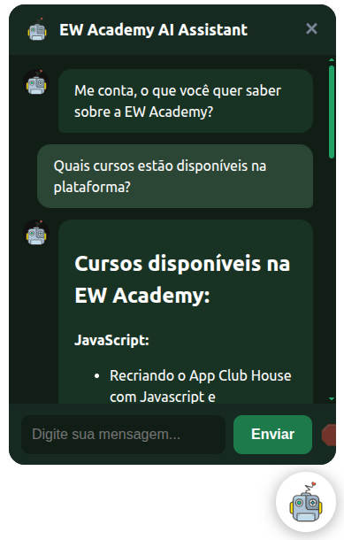

<div align="center">

# Chatbot Inteligente 100% Offline com Prompt API do Chrome

Construindo um widget de chatbot embarcado que roda totalmente no navegador, explorando os recursos experimentais de AI locais da Chrome Prompt API.

</div>

## 🎥 Preview



---

## 🎯 Objetivo

Aprender, de forma prática, como criar um chatbot que usa **modelos de IA locais / embarcados** via recursos experimentais do Chrome, sem depender de um backend externo.

## 🚀 Recursos Principais

- 100% offline (sem chamadas para servidores – ideal para protótipos e privacidade).
- API moderna do Chrome (Prompt API / AI APIs experimentais).
- Arquitetura simples com separação entre Controller, View e Services.
- Suporte a mensagens streaming simuladas / indicador de digitação.
- Fácil de estilizar via CSS custom properties.
- Preparado para abortar requisições (ex: botão Stop nas aulas avançadas).

## 🧱 Arquitetura e Estrutura do Widget

```

sdk/
    ew-chatbot.html      # Snippet para embutir
    ew-chatbot.css       # Estilos e variáveis CSS
    src/
        index.js           # Bootstrapping
        controllers/chatBotController.js
        views/chatBotView.js
        services/promptService.js (adapta chamadas de IA)
    botData/
        systemPrompt.txt
        chatbot-config.json
        avatar.webp
```

## ✅ Pré-requisitos

- Node.js 22+ (para scripts utilitários e servidor estático simples).
- Navegador **Chrome** (versão compatível com as AI / Prompt APIs experimentais).
- Habilitar flags experimentais:
    - [chrome://flags/#prompt-api-for-gemini-nano](chrome://flags/#prompt-api-for-gemini-nano)
        - Habilitar as opções: (Prompt API for Gemini Nano | Prompt API for Gemini Nano with Multimodal Input)

## ⚡ Instalação Rápida

Clone o repositório e instale as dependências dentro da pasta da aula desejada.

Exemplo para acessar a primeira aula:
```bash
git clone https://github.com/joaoathaide/chatbot-ai.git

cd chatbot-ai

npm ci
npm start
```

E então interaja pelo widget no canto da tela.

## ⚠️ Limitações e Avisos

- As Chrome AI / Prompt APIs ainda são experimentais e podem mudar ou exigir flags.
- Recursos offline dependem do suporte do navegador / hardware local.
- Este projeto é educacional – não destina-se a produção sem revisões de segurança.

## ❓ FAQ

**Funciona em Firefox / Safari?**  Atualmente o foco é Chrome (APIs experimentais específicas).

**Preciso de servidor backend?**  Não para o núcleo demonstrado; tudo roda no cliente.

**Como altero o prompt inicial?**  Edite `botData/systemPrompt.txt`.